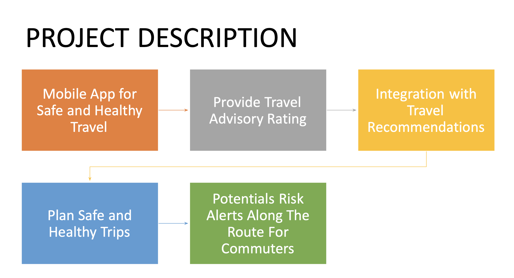
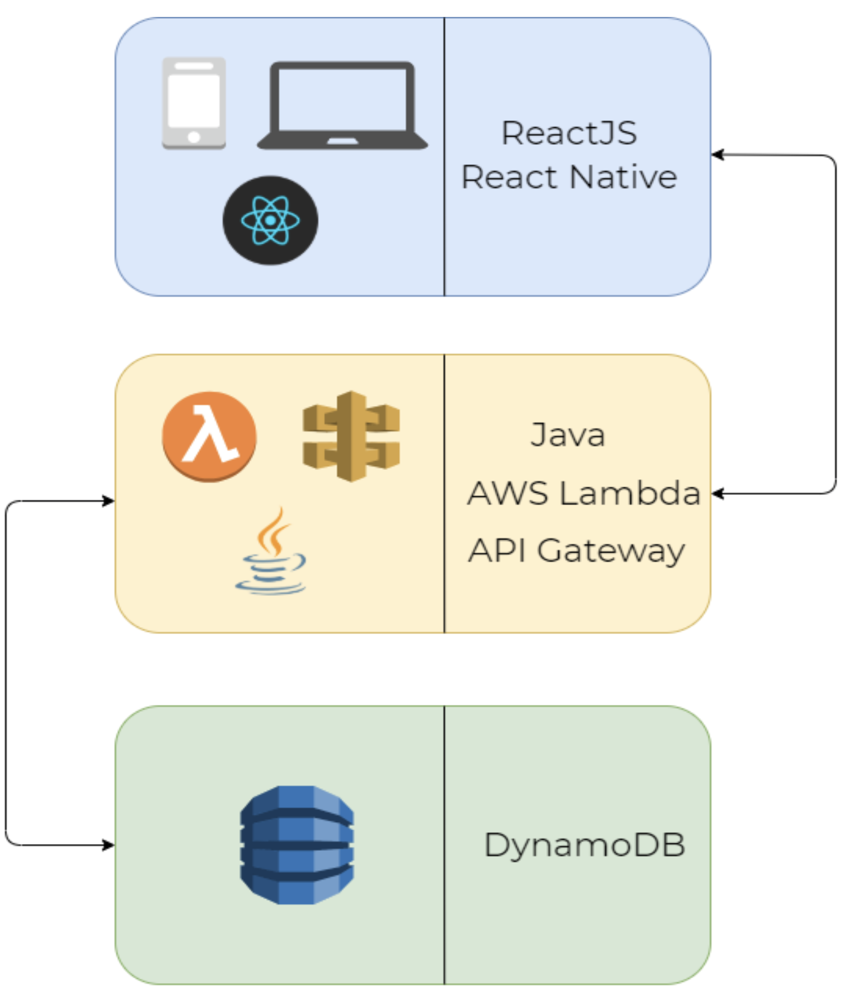
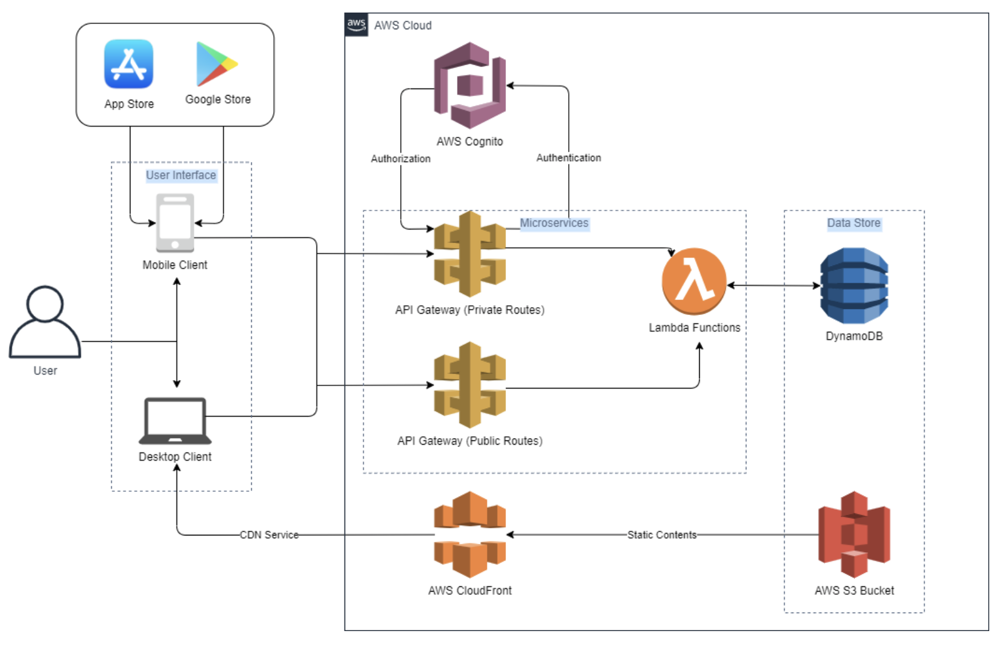
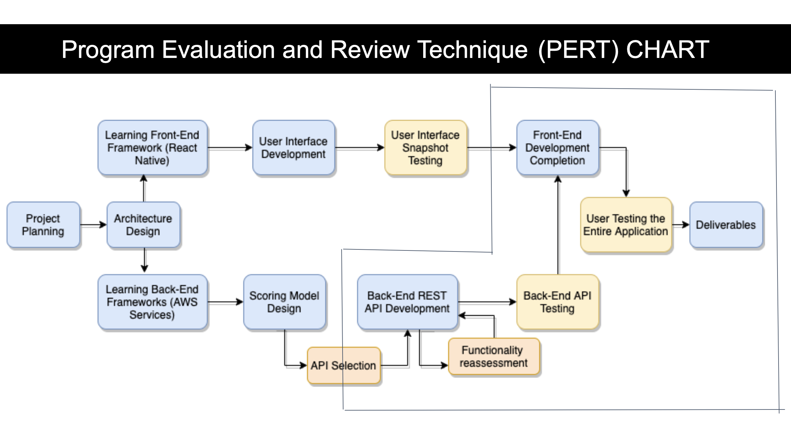

# TravSafe-Component-BuildAndTesting

Testing Repo to work on components and Basic Layout/Functioning

This repo only holds a basic starter model for the project

(The main project is under a private organization, if you need access, feel free to reach out)

## A Safety Travel Rating App

- this is a test repo for building and testing components and project flow.

## Problem Statement

- TravSafe mobile application is designed to provide travelers around the world with safe and healthy travel by providing them with real-time travel advisory ratings. In addition to travelers, travsafe also provides commuters with the option to save their commute route and provide them with hazards and real-time alerts along with the route.
- This helps the user to change their route and make better decisions. Travelers will be able to make wise and safe travel decisions using this app for all different locations they want to travel to. TravSafe provides users with to book flights, hotels, obtain a local guide along with getting safety ratings.

## Architecture

### HLA

### Low Level Architecture

## PERT Chart

## The Components in this repo do as following

